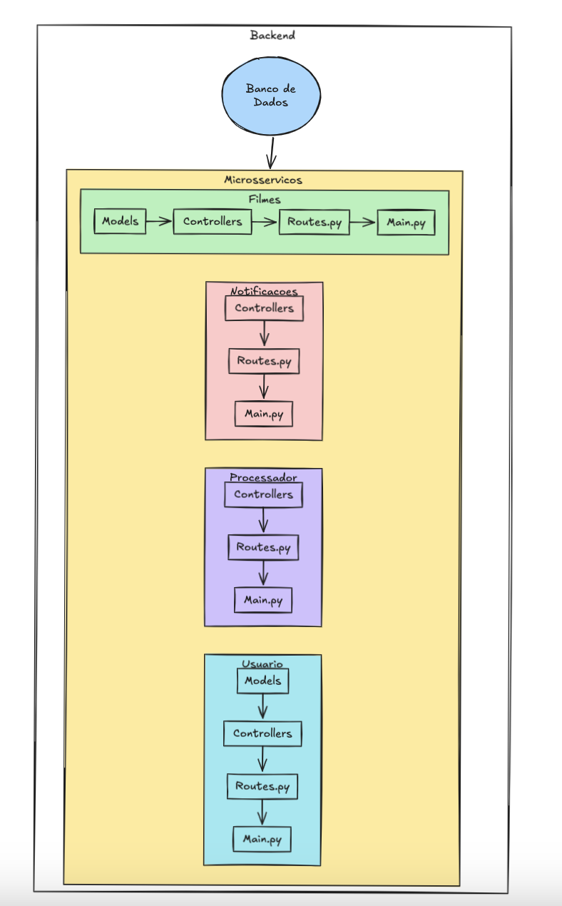

# Documentação da Arquitetura

## Descrição
Este sistema segue uma arquitetura baseada em microsserviços com os seguintes componentes:

- **Processador de Vídeo**: Extrai frames e atualiza status.
- **Usuário**: Gerencia autenticação e controle de usuários.
- **Filmes**: Registra vídeos e seus status.
- **Notificações**: Envia e-mails sobre status dos vídeos.
- **RabbitMQ**: Coordena o processamento assíncrono.
- **MySQL**: Banco de dados relacional.

## Diagrama da Arquitetura

